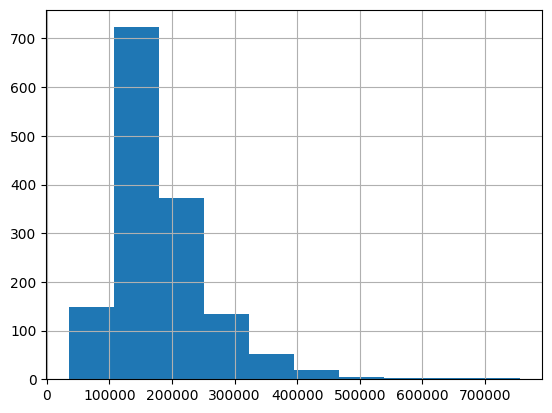
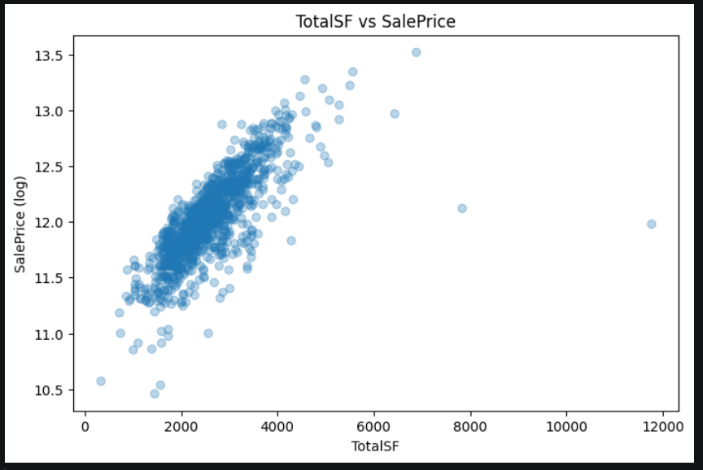
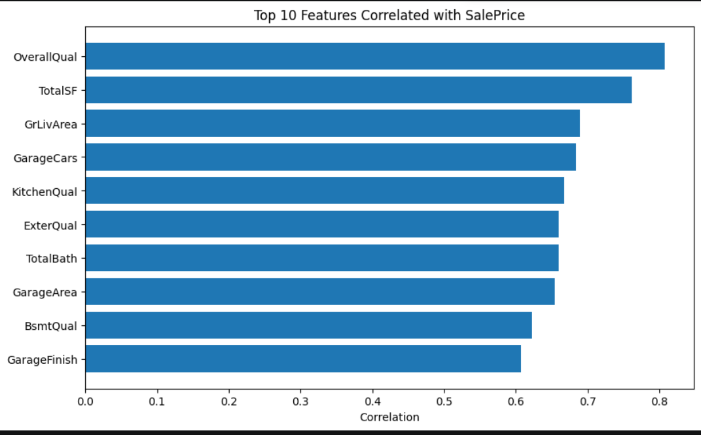
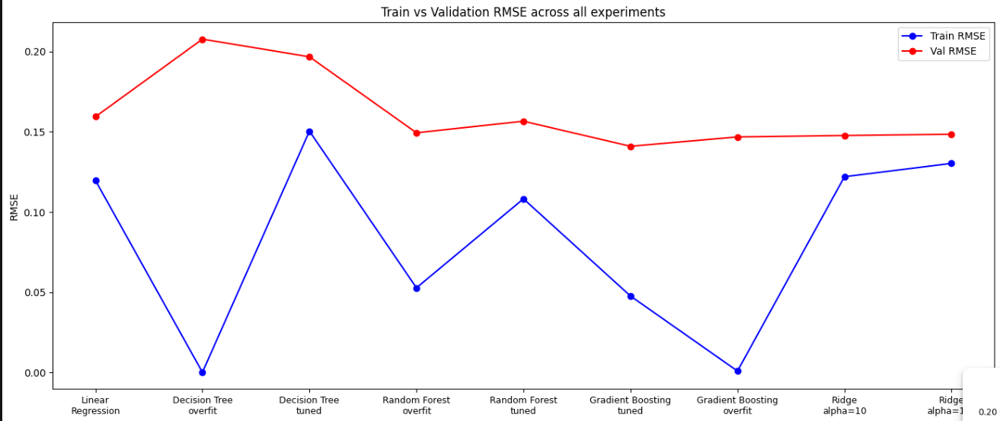

# House Prices — Advanced Regression Techniques


## კონკურსის მიმოხილვა

ეს კონკურსი სახლების ფასების პროგნოზირებაზეა. მონაცემებში 81 სვეტია სახლის სხვადასხვა მახასიათებელი — ზომა, ხარისხი, გარაჟი, სარდაფი, სამეზობლო და ა.შ. ამოცანაა რაც შეიძლება ზუსტად ვიპოვოთ სახლის SalePrice. შეფასება ხდება საშუალო კვადრატული გადახრით (RMSE) ლოგარითმულად გარდაქმნილ ფასებზე, ანუ კარგი მოდელი ერთნაირად კარგად უნდა პროგნოზირებდეს იაფ და ძვირ სახლებს.

ჩემი მიდგომა

- მონაცემების გაწმენდა (NaN-ების შევსება, უსარგებლო სვეტების მოცილება)
- Feature Engineering — ახალი სვეტების შექმნა, კატეგორიული ცვლადების კოდირება
- Feature Selection — დაბალი variance-ის და კორელაციის მიხედვით სვეტების გარიყვა
- მოდელების ტრენინგი — Linear Regression, Random Forest (overfitted და regularized)
- ყველა ექსპერიმენტის MLflow-ში დალოგვა DagsHub-ზე


## სტრუქტურა

```
ML-HW-1/
│
├── model_experiment.ipynb   ← მთავარი notebook: cleaning, feature eng., training, mlflow
├── model_inference.ipynb    ← საუკეთესო მოდელი model registry-იდან, submission
├── data/
│   ├── train.csv
│   ├── test.csv
│   └── sample_submission.csv
├── models/
│   ├── gradient_boosting_best.pkl
│   └── train_columns.pkl
├── README.md
└── requirements.txt
```


მონაცემთა გაწმენდა

პირველი რაც გავაკეთე — SalePrice-ზე log1p გამოვიყენე. ეს იმიტომ, რომ ფასის განაწილება მარჯვნივ იყო გადახრილი. log-ის შემდეგ განაწილება ბევრად უფრო ნორმალური გახდა, რაც წრფივი რეგრესიისთვის კარგია.




შევხედე რომელ სვეტებს ყველაზე მეტი გამოტოვებული მნიშვნელობა ჰქონდათ:

PoolQC           1453
MiscFeature      1406
Alley            1369
Fence            1179

ეს სვეტები სრულად წავშალე. როდესაც სვეტის 80%-ზე მეტი მონაცემი აკლია, შევსება უფრო "ხმაურს" შემოიტანს ვიდრე სასარგებლო ინფორმაციას — მოდელი არარსებულ კანონზომიერებებზე დაიწყებს სწავლას.

# Numeric 
შევავსე შუამდგომი მნიშვნელობით (მედიანა). საშუალოს ნაცვლად მედიანა ავირჩიე, რადგან ის უკიდურეს მნიშვნელობებს ნაკლებად ექვემდებარება. მაგ. LotFrontage-ში ზოგ სახლს ძალიან დიდი ეზო ჰქონდა — საშუალო ამ გამო გაიზრდებოდა და ყველა სახლს "დიდ" ეზოს მივანიჭებდით.

# categories
 შევავსე "None" სტრინგით. ეს ლოგიკური იყო, რადგან მრავალ შემთხვევაში გამოტოვება უბრალოდ ნიშნავდა "არ არის" (მაგ. BsmtQual გამოტოვებული = სარდაფი არ არის).


## Feature Engineering

## categories

Ordinals
ბევრ სვეტს ჰქონდა ხარისხობრივი სკალა (Ex > Gd > TA > Fa > Po). ამ სვეტებს ხელით შევუსაბამე რიცხვები, რადგან ერთნაირი-სიგრძის კოდირება ამ შემთხვევაში რიგობრივ ინფორმაციას დაკარგავდა — Ex-სა და Po-ს შუა ნამდვილად არის სხვაობა:
quality_map = {"Ex": 5, "Gd": 4, "TA": 3, "Fa": 2, "Po": 1, "None": 0}
ამ გზით დავამუშავე: ExterQual, ExterCond, BsmtQual, BsmtCond, HeatingQC, KitchenQual, GarageQual, GarageCond და სხვა.

nominals
სვეტებზე, სადაც კატეგორიებს შორის რიგობრიობა არ იყო (მაგ. Neighborhood, MSZoning, GarageType), გამოვიყენე ერთნაირი-სიგრძის კოდირება. CentralAir-ს პირდაპირ 0/1-ად გარდავაქმნი, რადგან მხოლოდ კი/არა მნიშვნელობები ჰქონდა.

## ახალი სვეტების შექმნა

| ახალი სვეტი | ფორმულა | მიზანი |
|---|---|---|
| `TotalSF` | `TotalBsmtSF + 1stFlrSF + 2ndFlrSF` | სახლის მთლიანი ფართობი ერთ სვეტში |
| `HouseAge` | `YrSold - YearBuilt` | სახლის ასაკი გაყიდვის მომენტში |
| `RemodAge` | `YrSold - YearRemodAdd` | რემონტის შემდეგ გასული წლები |
| `WasRemodeled` | `1 თუ YearBuilt != YearRemodAdd` | გადაკეთდა თუ არა (ბინარული) |
| `TotalBath` | `FullBath + 0.5*HalfBath + BsmtFullBath + 0.5*BsmtHalfBath` | ყველა სველი წერტილის ჯამი |
| `HasGarage` | `1 თუ GarageArea > 0` | ავტოფარეხი აქვს თუ არა |
| `HasPool` | `1 თუ PoolArea > 0` | აუზი აქვს თუ არა |
| `HasFireplace` | `1 თუ Fireplaces > 0` | ბუხარი აქვს თუ არა |
| `HasBsmt` | `1 თუ TotalBsmtSF > 0` | სარდაფი აქვს თუ არა |
| `TotalPorch` | `OpenPorchSF + EnclosedPorch + 3SsnPorch + ScreenPorch + WoodDeckSF` | მთლიანი გარე სივრცე |
| `LotArea_log` | `log1p(LotArea)` | ეზოს ფართობი log-სკალაზე |
| `GrLivArea_log` | `log1p(GrLivArea)` | საცხოვრებელი ფართობი log-სკალაზე |



TotalSF ყველაზე მაღალ კავშირს გამოავლენდა SalePrice-თან ვიდრე ცალ-ცალკე 1stFlrSF ან 2ndFlrSF.


## Feature Selection
1. Variance ფილტრი (threshold < 0.01)
სვეტები, რომლებშიც მნიშვნელობები თითქმის ყოველთვის ერთი და იგივეა (variance < 0.01), ამოვიღე. ასეთ სვეტს მოდელი ვერ გამოიყენებს — თუ ყველა სახლს ერთი და იგივე მნიშვნელობა აქვს, ეს სვეტი პროგნოზს ვერ დაეხმარება.
2. კორელაციის ფილტრი SalePrice-თან (threshold < 0.05)
სვეტები, რომელთაც SalePrice-თან კორელაცია 0.05-ზე ნაკლები ჰქონდათ, ამოვიღე. ეს სვეტები პრაქტიკულად არანაირ კავშირს არ ამჟღავნებდნენ სამიზნე ცვლადთან.

ყველაზე მაღალი კავშირი ჰქონდა: OverallQual, TotalSF, GrLivArea, GarageCars, GarageArea — ეს ლოგიკურია, ზოგადი ხარისხი და ფართობი ყველაზე მეტად განსაზღვრავს ფასს.

## Training


ყველა ექსპერიმენტი დარეგისტრირდა MLflow-ში DagsHub-ზე. თითოეული run-ისთვის დავლოგე: მოდელის ტიპი, ჰიპერპარამეტრები, train_rmse, val_rmse და მოდელის არტეფაქტი


## ექსპერიმენტი 1
## Linear Regression 

```python
model = LinearRegression()
```

| | Train RMSE | Val RMSE |
|---|---|---|
| შედეგი | 0.1197 | 0.1594 |
ანალიზი: პირველი მოდელი გავუშვი Baseline-ის სახით — იმის გასაგებად, საიდან ვიწყებთ. Train და Val RMSE ორივე მაღალია, gap კი პატარა (0.04), რაც underfitting-ის ნიშანია. Linear Regression ცდილობს პირდაპირი ხაზით აღწეროს სახლების ფასების დამოკიდებულება, მაგრამ ეს მონაცემები ბევრად უფრო რთულ, არახაზოვან პატერნებს მიჰყვება. მოდელი ბევრ კავშირს ვერ "ხედავს".


## ექსპერიმენტი 2
## Decision Tree (Overfit)
```python
model = DecisionTreeRegressor(max_depth=None, random_state=42)
```

| | Train RMSE | Val RMSE | Gap |
|---|---|---|---|
| შედეგი | 0.0000 | 0.2078 | **0.2078** |

ანალიზი: max_depth=None-ით Decision Tree-მ სრულყოფილად დაიმახსოვრა ყველა training სახლი — Train RMSE = 0.0, ანუ ყველა პროგნოზი ზუსტი იყო. მაგრამ Val RMSE = 0.2078 — ეს ყველა მოდელს შორის ყველაზე ცუდი შედეგია. ეს არის overfitting-ის ყველაზე კარგი მაგალითი — მოდელმა training მონაცემები "დაიზეპირა" გავრცელების ნაცვლად.


## ექსპერიმენტი 3 
## Decision Tree (Tuned)
```python
model = DecisionTreeRegressor(max_depth=5, random_state=42)
```
 
| | Train RMSE | Val RMSE | Gap |
|---|---|---|---|
| შედეგი | 0.1504 | 0.1974 | 0.0470 |
 
ანალიზი: სიღრმის `max_depth=5`-ით შეზღუდვით Train RMSE გაიზარდა (0.0 → 0.1504) მაგრამ Val RMSE **მნიშვნელოვნად გაუმჯობესდა** (0.2078 → 0.1974). Gap შემცირდა 0.2078-დან 0.047-მდე — overfitting ბევრად ნაკლებია. Decision Tree მაინც ჩამოუვარდება ყველა სხვა კომპლექსურ მოდელს, რადგან ის ერთი ხეა — ბევრი pattern ვერ ისწავლა.
 
## ექსპერიმენტი 4 
## Random Forest (Overfit)
 
```python
model = RandomForestRegressor(n_estimators=500, max_depth=None, random_state=42)
```
 
| | Train RMSE | Val RMSE | Gap |
|---|---|---|---|
| შედეგი | 0.0527 | 0.1494 | **0.0967** |
 
ანალიზი: `max_depth=None`-ით Random Forest-მა ისწავლა training მონაცემები ძალიან კარგად (Train RMSE: 0.0527), მაგრამ val-ზე შედეგი ბევრად უარესია (Val RMSE: 0.1494). დიდი gap (0.097) **overfitting-ის** ნიშანია — 500 ხემ training სახლები "დაიზეპირა". Random Forest Decision Tree-ზე გაუმჯობესებულია (500 ხე > 1 ხე), მაგრამ შეზღუდვების გარეშე კვლავ overfitting-ია.


##  ექსპერიმენტი 5 
## Random Forest (max_depth=10)
 
```python
model = RandomForestRegressor(n_estimators=500, max_depth=10, random_state=42)
```
 
| | Train RMSE | Val RMSE | Gap |
|---|---|---|---|
| შედეგი | 0.0593 | 0.1503 | 0.0910 |
 
ანალიზი: `max_depth=10`-ის დამატებით Train RMSE გაიზარდა (0.0527 → 0.0593) მაგრამ Val RMSE **თითქმის არ შეცვლილა** (0.1494 → 0.1503). gap კვლავ დიდია (0.091), რაც ნიშნავს, რომ **მხოლოდ სიღრმის შეზღუდვა საკმარისი არ არის** overfitting-ის გამოსასწორებლად. შემდეგ ექსპერიმენტში ვცდი რამდენიმე პარამეტრის ერთდროულ შეცვლას.

## ექსპერიმენტი 6 
## Random Forest (Tuned)
 
```python
model = RandomForestRegressor(n_estimators=200, max_depth=6, min_samples_leaf=4, random_state=42)
```
 
| | Train RMSE | Val RMSE | Gap |
|---|---|---|---|
| შედეგი | 0.1082 | 0.1566 | **0.0484** |
 
ანალიზი: `max_depth=6` და `min_samples_leaf=4`-ის **ერთდროული** გამოყენებით gap მნიშვნელოვნად შემცირდა (0.097 → 0.048) — overfitting ბევრად ნაკლებია. თუმცა Val RMSE ოდნავ გაიზარდა (0.1494 → 0.1566) — ეს კლასიკური **bias-variance tradeoff**-ია: რაც უფრო ვზღუდავთ მოდელს overfitting-ის თავიდან ასაცილებლად, მით უფრო ვუახლოვდებით underfitting-ს.


## ექსპერიმენტი 7 
## Gradient Boosting (Tuned) 
```python
model = GradientBoostingRegressor(n_estimators=300, learning_rate=0.05, max_depth=4, random_state=42)
```
 
| | Train RMSE | Val RMSE | Gap |
|---|---|---|---|
| შედეგი | 0.0476 | **0.1410** | 0.0934 |
 
ანალიზი: **ყველა მოდელს შორის საუკეთესო** Val RMSE = 0.141. Boosting მიდგომა, სადაც თითოეული ხე სწავლობს წინა ხის **შეცდომებიდან**, აღმოჩნდა ყველაზე ეფექტური ამ მონაცემებისთვის. `learning_rate=0.05` (პატარა ნაბიჯები) + `n_estimators=300` (ბევრი ხე) + `max_depth=4` (ზომიერი სიღრმე) — ეს კომბინაცია ოპტიმალური ბალანსი იყო სირთულეს და გენერალიზაციას შორის.


##  ექსპერიმენტი 8 
## Ridge Regression (alpha=10)
 
```python
model = Ridge(alpha=10)
```
 
| | Train RMSE | Val RMSE | Gap |
|---|---|---|---|
| შედეგი | 0.1220 | 0.1477 | 0.0257 |
 
ანალიზი: Linear Regression-თან შედარებით Ridge-მა **მნიშვნელოვნად გააუმჯობესა** Val RMSE (0.1594 → 0.1477). `alpha=10` პენალტი ზღუდავს დიდ კოეფიციენტებს, რაც overfitting-ის ნაწილს ართმევს. gap ძალიან პატარაა (0.025) — მოდელი კარგად განაზოგადებს, მაგრამ მისი წრფივი ბუნება კვლავ ზღუდავს შესაძლებლობებს.
 
---
 
##  ექსპერიმენტი 9 
## Gradient Boosting (Overfit)
 
```python
model = GradientBoostingRegressor(n_estimators=500, learning_rate=0.1, max_depth=6, random_state=42)
```
 
| | Train RMSE | Val RMSE | Gap |
|---|---|---|---|
| შედეგი | **0.0008** | 0.1490 | **0.1482** |
 
ანალიზი: `learning_rate=0.1` (დიდი ნაბიჯები) + `n_estimators=500` (ბევრი ხე) + `max_depth=6` (ღრმა ხეები) = კლასიკური **Boosting overfitting**. Train RMSE = 0.0008 — თითქმის სრულყოფილი. Val RMSE = 0.149 — Gap = 0.148. სწრაფი სწავლება + ბევრი ხე + ღრმა ხეები training მონაცემებს "ზეპირდება". Val RMSE-ც კი უარესია ვიდრე tuned ვარიანტში (0.149 > 0.141), რადგან ეს overfitting-ი ზოგად პატერნებს ამახინჯებს.
 
---
 
##  ექსპერიმენტი 10 
## Ridge Regression (alpha=100)
 
```python
model = Ridge(alpha=100)
```
 
| | Train RMSE | Val RMSE | Gap |
|---|---|---|---|
| შედეგი | 0.1303 | 0.1486 | 0.0183 |
 
ანალიზი: `alpha=10`-თან შედარებით `alpha=100` ოდნავ **უარესია** (Val 0.1477 → 0.1486). ძალიან დიდი პენალტი მოდელს ზედმეტად ზღუდავს — Train RMSE-ც გაიზარდა (0.122 → 0.130), რაც **underfitting-ის** ნიშანია. ოპტიმალური alpha ამ მონაცემებისთვის 10-ის მახლობლობაშია.


## ყველა ექსპერიმენტის შედარება
 

 
| მოდელი | Train RMSE | Val RMSE | პრობლემა |
|---|---|---|---|
| Linear Regression | 0.1197 | 0.1594 | Underfitting |
| Decision Tree (overfit) | 0.0000 | 0.2078 | ძლიერი Overfitting |
| Decision Tree (tuned) | 0.1504 | 0.1974 | კვლავ სუსტი |
| Random Forest (overfit) | 0.0527 | 0.1494 | Overfitting |
| Random Forest (tuned) | 0.1082 | 0.1566 | Bias-Variance tradeoff |
| **Gradient Boosting (tuned)** | **0.0476** | **0.1410** | **✅ საუკეთესო** |
| Gradient Boosting (overfit) | 0.0008 | 0.1490 | ძლიერი Overfitting |
| Ridge (alpha=10) | 0.1220 | 0.1477 | კარგი, მაგრამ წრფივი |
| Ridge (alpha=100) | 0.1303 | 0.1486 | ოდნავი Underfitting |


## საბოლოო მოდელი — Gradient Boosting
 
**პარამეტრები:** `n_estimators=300`, `learning_rate=0.05`, `max_depth=4`
**Val RMSE: 0.141** | **Kaggle Score: ~0.14 RMSLE**
 
**რატომ Gradient Boosting?**
 
სახლების ფასები განისაზღვრება **არახაზოვანი ურთიერთქმედებებით** — `OverallQual` × `Neighborhood` × `GrLivArea` ერთობლიობა ფასზე ბევრად მეტ გავლენას ახდენს ვიდრე ცალ-ცალკე. Linear Regression ამ ურთიერთქმედებებს ვერ ხედავს. Decision Tree ერთი ხეა, ვერ ისწავლის საკმარისად. Random Forest კარგია, მაგრამ Boosting-ი სჯობია, რადგან **თითოეული ხე სწავლობს წინა ხის შეცდომებიდან** — residual-ებზე ტრენინგი ბევრად ეფექტურია ვიდრე დამოუკიდებელი ხეების ანსამბლი.


## MLflow Tracking — DagsHub
 
🔗 **ექსპერიმენტების ბმული:** [https://dagshub.com/karev23/ML-HW-1/experiments](https://dagshub.com/karev23/ML-HW-1/experiments)
 
**დარეგისტრირებული მოდელი:** `house-prices-best-model` (Version 2)
 
თითოეულ run-ში დაილოგა:
 
| პარამეტრი / მეტრიკა | მნიშვნელობა |
|---|---|
| `model_type` | მოდელის სახეობა (LinearRegression, RandomForest, GradientBoosting და ა.შ.) |
| ჰიპერპარამეტრები | `n_estimators`, `max_depth`, `learning_rate`, `alpha` და სხვა |
| `train_rmse` | training set-ზე RMSE (log სივრცეში) |
| `val_rmse` | validation set-ზე RMSE (log სივრცეში) |
| model artifact | sklearn მოდელი `.pkl` ფორმატში |
 
**Model Registry:** საუკეთესო Gradient Boosting მოდელი (`run_id: 867976603a40454183ac933e1aaebb17`) Model Registry-ში დარეგისტრირდა სახელით `house-prices-best-model`, Version 2.

